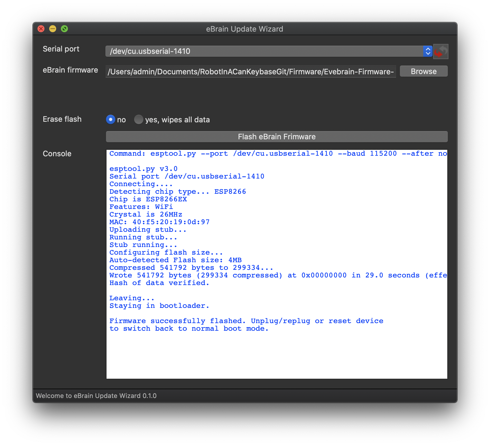

Self-contained [NodeMCU](https://github.com/nodemcu/nodemcu-firmware) flasher with GUI based on [esptool.py](https://github.com/espressif/esptool) and [wxPython](https://www.wxpython.org/).



## Installation
eBrain Wizard / eBrain-Flasher doesn't have to be installed, just double-click it and it'll start. Check the [releases section](https://github.com/opencoca/nodemcu-pyflasher/releases) for downloads for your platform. For every release there's at least a .exe file for Windows. Starting from 5.0.0 there's also a .dmg for macOS.

## Status
Scan the [list of open issues](https://github.com/marcelstoer/nodemcu-pyflasher/issues) for bugs and pending features.

**Note**


## Getting help
In the unlikely event that you're stuck with this simple tool the best way to get help is to turn to the ["Tools and IDE" subforum on esp8266.com](http://www.esp8266.com/viewforum.php?f=22).


## Build it yourself
If you want to build this application yourself you need to:

- Install [Python 3.x](https://www.python.org/downloads/)
- Install [PipX]
```
    python3 -m pip install --user pipx
    python3 -m pipx ensurepath
```
- Install [Pipenv](https://pypi.org/project/pipenv/)  `pipx install pipenv`
- run `pipenv install` inside the project dir
- Install [Brew](//brew.sh) `/bin/bash -c "$(curl -fsSL https://raw.githubusercontent.com/Homebrew/install/HEAD/install.sh)"`
- Install [create-dmg](https://github.com/create-dmg/create-dmg) `brew install create-dmg`

**A note on Linux:** As described on the [downloads section of `wxPython`](https://www.wxpython.org/pages/downloads/), wheels for Linux are complicated and may require you to run something like this to install `wxPython` correctly:

```bash
# Assuming you are running it on Ubuntu 18.04 LTS with GTK3
pipenv install \
    -f https://extras.wxpython.org/wxPython4/extras/linux/gtk3/ubuntu-18.04 \
    wxPython
```

## Why this project exists

### Motivation
This addresses an issue the NodeMCU community touched on several times in the past, most recently at
 [#1500 (comment)](https://github.com/nodemcu/nodemcu-firmware/pull/1500#issuecomment-247884981).

I stated that based on my experience doing NodeMCU user support it should be a lot simpler to flash NodeMCU for Windows users.

- A number of flashing tools are available but only two are actively maintained: esptool-ck and esptool.py. Only one is endorsed by Espressif: [esptool.py](https://github.com/espressif/esptool) (they hired the developer(s)).
- 70% of the users of my [nodemcu-build.com](https://nodemcu-build.com) service are on Windows.
- BUT Windows doesn't come with Python installed - which is required for esptool.py.
- BUT Windows users in general are more reluctant to use the CLI than Linux/Mac users - which is required for esptool.py.

To conclude: this is not a comfortable situation for NodeMCU's largest user group.

### The plan
For quite a while I planned to write a self-contained GUI tool which would use esptool.py in the background. It should primarily target Windows users but since I'm on Mac it should be cross-platform. Even though I had never used Python before I felt confident to pull this off.

### Implementation
- Uses the cross-platform wxPython GUI framework. I also tried PyForms/PyQt4 but settled for wxPython.
- Requires absolutely minimal user input.
- The esptool.py "console" output is redirected to text control on the GUI.
- Uses [PyInstaller](https://github.com/pyinstaller/pyinstaller) to create self-contained executable for Windows and Mac. The packaged app can run standalone i.e. without installing itself, a Python interpreter or any modules.

## License
[MIT](http://opensource.org/licenses/MIT) © Marcel Stör
